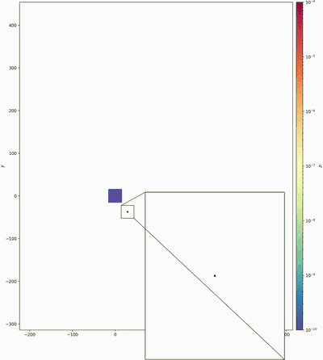

# AthenaK for tidal disruption events and other astrophysical flows

<p align="center">
  <a href="https://youtu.be/Roow6KcmfUI">
    
  </a>
  <br>
  <em>Tidal disruption of a 1&nbsp;M<sub>&#9737;</sub> star by a 10<sup>3</sup>&nbsp;M<sub>&#9737;</sub> black hole (black dot):
  gas density in the orbital plane of the fiducial (FID) run over seven fallback times of the most
  bound debris (7&nbsp;P<sub>mb</sub>).  The inset follows the pericenter region; white areas lie outside the
  computational box, which grows with each remap.
  <a href="https://youtu.be/Roow6KcmfUI">YouTube</a> &middot;
  <a href="https://github.com/HongxuanJiang/athenak-transients/releases/download/v1.0.0/tde_fid_7pmb_full.mp4">original-resolution MP4</a></em>
</p>

An extended version of [AthenaK](https://github.com/IAS-Astrophysics/athenak) for GPU
simulations of self-gravitating, radiation-pressure-dominated astrophysical flows, together
with tools that turn the simulation output into synthetic observables.  Tidal disruption
events (TDEs) are the first fully validated application: the code follows a star from
hydrostatic equilibrium through its disruption by a black hole and the fallback of the
debris in one calculation.  The components are not specific to TDEs, and the framework is
being developed as a general-purpose tool for other problems, such as stellar collisions
and mergers, common-envelope evolution, and other transients.

> Jiang, H.-X., Yang, M., Velasco-Romero, D. A., Yu, F., Xia, J.-Z., Li, X., and Mizuno, Y.,
> *An End-to-End Numerical Framework for Tidal Disruption Events with AthenaK*,
> The Astrophysical Journal Supplement Series (accepted), [arXiv:2609.37859](https://arxiv.org/abs/2609.37859).

## Highlights

### 1. End-to-end simulations on GPUs

* **Tabulated H/He equation of state** with molecular hydrogen, ionization, and radiation
  pressure, with an EOS-balanced stellar initialization and a table generator
  (`./get_eos_table.sh`, `scripts/generate_lte_table.py`).
* **Multigrid self-gravity** on the AMR hierarchy, with a physical solve cadence.
* **Dual-energy formalism** for cold, highly supersonic flow.
* **Localized adaptive time stepping (LAT)**: each MeshBlock advances with its own time
  step, coupled to self-gravity.
* **Conservative remapping** of a running calculation onto a new, larger mesh, with
  conversion between reference frames (`src/remap`).
* **Sink particles** (`src/sink_particles`).
* **TDE problem generator** (`src/pgen/tde_external.cpp`): star and orbit setup, a frame
  that translates with the star, a live black hole with an excised inner boundary, and
  refinement criteria that follow the debris stream.  A complete five-step example is in
  [`inputs/TDE_examples/`](inputs/TDE_examples).

### 2. `athenak_rt`: synthetic observables from AthenaK snapshots

[`athenak_rt/`](athenak_rt) is a Python package that turns AthenaK Cartesian snapshots (uniform
or AMR) into line-of-sight luminosities, spectra, and images:

* **multifrequency H/He continuum transfer**: free-free and bound-free absorption of H and
  He with the ionization fractions of the tabulated EOS, and electron scattering through a
  thermalization-depth treatment;
* **grey reference modes**: the formal solution, the formal solution with thermalization,
  and the tau = 1 photosphere.

It is not specific to TDEs.  It works on any AthenaK hydrodynamic snapshot written with
the tabulated LTE equation of state; a black-hole excision mask is applied only when the
snapshot defines one.  The optional Saha solver (`populations = saha`) assumes
`X = 0.7`, `Y = 0.3`.

The radiative transfer in `athenak_rt` follows the photospheric post-processing method of
[Yang et al. (2026, ApJ, 998, 118)](https://ui.adsabs.harvard.edu/abs/2026ApJ...998..118Y) ([arXiv:2510.25547](https://arxiv.org/abs/2510.25547)), adapted to Cartesian
AthenaK output.  Publications that use `athenak_rt` should cite Yang et al. (2026) and
Jiang et al. (2026).

```bash
cd /path/to/athenak
python -m athenak_rt bin/TDEExternalLTEPrad.hydro_w.00327.bin --mode multifreq --direction z \
    --eos-table eos_tables/chabrier2021_t13_helm_union_prad_640.table --out rt_z
```

See [`docs/athenak_rt.md`](docs/athenak_rt.md) for all modes and
options.

## Scope and support

This repository is a fork of AthenaK (Stone et al. 2024), developed at the Institute for
Advanced Study (IAS).  We maintain and support the components listed above and `athenak_rt`.
The TDE workflow of Jiang et al. is their validated reference application; using them
for other problems is welcome, and we are glad to hear about it.  For general use of
AthenaK, including the other physics modules and problem generators, please refer to the
[official AthenaK documentation](https://ias-astrophysics.github.io/athenak-docs) and the
[upstream repository](https://github.com/IAS-Astrophysics/athenak); those parts of this
tree are provided as-is.

**LAT for MHD and GRMHD.** In this release, LAT is available for hydrodynamics, including self-gravity. The development version of the code also supports LAT for MHD and GRMHD, including GRMHD on dynamical spacetimes. These paths are not included in this public release; they are available on request from Hong-Xuan Jiang (masterjoe2000@outlook.com).

## Getting started

Build the TDE problem generator, for example for NVIDIA GPUs with MPI:

```bash
git clone --recursive https://github.com/HongxuanJiang/athenak-transients.git athenak
cd athenak
cmake -S . -B build_tde -D PROBLEM=tde_external -D Athena_ENABLE_MPI=ON \
      -D Kokkos_ENABLE_CUDA=ON -D Kokkos_ARCH_VOLTA70=ON \
      -D CMAKE_CXX_COMPILER=$PWD/kokkos/bin/nvcc_wrapper
cmake --build build_tde -j 16
```

Set `Kokkos_ARCH_*` for your GPU.  For other platforms, see the upstream pages on
[requirements](https://ias-astrophysics.github.io/athenak-docs/requirements.html),
[download](https://ias-astrophysics.github.io/athenak-docs/download.html), and
[build](https://ias-astrophysics.github.io/athenak-docs/build.html).

Build the equation of state table with `./get_eos_table.sh` (see [Data](#data)).  Then
read the TDE user guide, [`docs/TDE/README.md`](docs/TDE/README.md), and run the
five example input files of the fiducial calculation in
[`inputs/TDE_examples/`](inputs/TDE_examples) by following
[`inputs/TDE_examples/README.md`](inputs/TDE_examples/README.md).

| Document | Content |
|---|---|
| [`docs/TDE/README.md`](docs/TDE/README.md) | Overview, units, build, quick start, module summaries, reproduction of the paper, troubleshooting |
| [`docs/TDE/parameters.md`](docs/TDE/parameters.md) | Reference of the input keys of `tde_external` and the related keys of other blocks |
| [`docs/TDE/outputs_and_analysis.md`](docs/TDE/outputs_and_analysis.md) | Output files and analysis scripts |
| [`docs/athenak_rt.md`](docs/athenak_rt.md) | Usage of `athenak_rt` |

## Data

The binary equation of state tables are not stored in git.  The example decks use
`chabrier2021_t13_helm_union_prad_640.table`.  Build it with the script in the top-level
directory:

```bash
./get_eos_table.sh
```

The script downloads the Chabrier et al. dense H/He tables from the authors' web page,
checks them, and writes `eos_tables/chabrier2021_t13_helm_union_prad_640.table` in about
two minutes.  It needs Python 3 with numpy and scipy, and curl or wget.  The values of the
table it writes are identical to those of the table used in the paper.  The Chabrier et al.
tables are not included in this repository because they are distributed without a license
that permits redistribution; their source and the manual steps are described in
[`scripts/chabrier2021_data/README.md`](scripts/chabrier2021_data/README.md).  The table
can also be downloaded from the release assets of this repository.  See
[`docs/eos_tables.md`](docs/eos_tables.md) for the other table jobs of the generator.

`athenak_rt` also uses MESA opacity tables, which are included in
`athenak_rt/data/`.

## Citation

If you use the TDE workflow, please cite the paper above
([arXiv:2609.37859](https://arxiv.org/abs/2609.37859)) and the AthenaK code paper.  If you use `athenak_rt`,
please also cite [Yang et al. (2026)](https://ui.adsabs.harvard.edu/abs/2026ApJ...998..118Y).
A BibTeX entry for each is given in [`docs/TDE/README.md`](docs/TDE/README.md#how-to-cite).

For more details on the features and algorithms implemented in AthenaK, see the code papers:
- [Stone et al (2024)](https://ui.adsabs.harvard.edu/abs/2024arXiv240916053S/abstract): basic framework
- [Zhu et al. (2024)](https://ui.adsabs.harvard.edu/abs/2024arXiv240910383Z/abstract): numerical relativity solver
- [Fields at al. (2024)](https://ui.adsabs.harvard.edu/abs/2024arXiv240910384F/abstract): GR hydro and MHD solver in dynamical spacetimes

Please reference these papers as appropriate for any publications that use AthenaK.
Tutorials for upstream AthenaK are in a separate repository,
[athenak-gallery](https://github.com/IAS-Astrophysics/athenak-gallery).

## Acknowledgments

AthenaK is a complete rewrite of the AMR framework and fluid solvers in the
[Athena++](https://github.com/PrincetonUniversity/athena) astrophysical MHD code using the
[Kokkos](https://kokkos.org/) programming model, which makes it performance-portable across
CPUs, GPUs from various vendors, and ARM processors.  It was developed in conjunction with
the [Parthenon AMR framework](https://github.com/parthenon-hpc-lab/parthenon) and is closely
related to the [AthenaPK MHD code](https://github.com/parthenon-hpc-lab/athenapk).  We thank
the AthenaK team for the code on which this work is built.

## License

This code is distributed under the BSD 3-Clause license inherited from AthenaK, see
[`LICENSE`](LICENSE).  The upstream copyright notice is retained:

```
Copyright (c) 2020, Institute for Advanced Study / High-Performance Computing / jmstone / Athena-Parthenon
All rights reserved.
```

The MESA opacity tables in `athenak_rt/data/` are redistributed under the MESA
and OPAL data terms, see `athenak_rt/data/NOTICE`.
